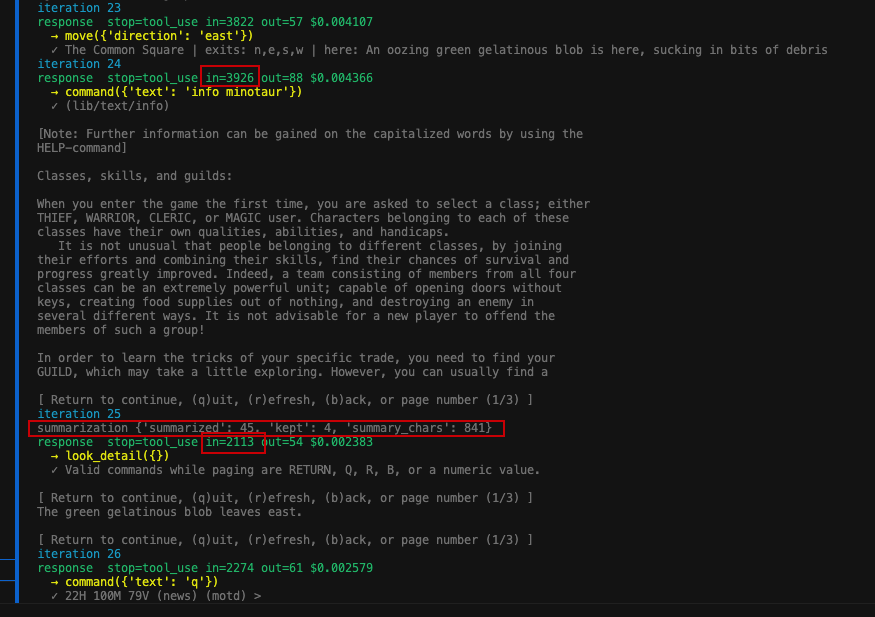
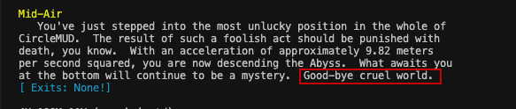

# Week 2/3 - Observable & Capable
### August 7, 2026 - C. Guy Slater

### Technical Goal(s)
- add **observability** to the agent framework to create visibility on tokens/cost/time
- reduce the token burn on long (to enable extended play without burning funds)
- keep building on the from-scratch framework rather than adopting a heavy agent SDK
- specific components added:
    - **observability** - OpenTelemetry/Logfire to capture tokens, cost, latency
    - **graceful exits** - a wrap-up warning near the iteration cap so the agent lands cleanly instead of crashing. Agent will print out a summary/status report
    - **perception compression** - parse raw room text into structured facts (`name | exits | entities`) via regex
    - **summarizer** - collapse old history into a compact state note (one model call) when context grows large (currently <u>*4000*</u> tokens triggers the compaction) 

### Technical Uncertainty

- where are costs going up: reasoning or large (resent) context?
- will compressing/summarizing context degrade the agent's play/ability?
- is the observability tool (Logfire) sufficient or is a separate visualization tool required (for keeping track of maps, etc)?

### Technical Hypotheses

##### **Note: These are presented as *null* hypotheses, not necessarily my expectation

- perception compression will not meaningfully reduce token cost
- summarization will make the agent lose track of its goals or state 
- the Logfire observability tool is unnecessary and insufficient
- context growth on long tasks is unavoidable (basically unbounded)

### Technical Observations

- **Logfire tracing worked**: task -> iteration -> api/tool spans, with per-call tokens, cost, and latency. The `time.sleep()` in the MUD socket reads showed up clearly as tool-call latency (an I/O cost separate from token cost)
- **perception compression**: ~50% per-room token reduction on average; empty rooms ~90% (e.g. *58 words* becomes *5 words*). `look_detail` fallback preserves previous content

- **summarizer produced a sawtooth** (verified twice in one run): context climbed to ~4k, summarization fired and dropped it (3,961 -> 1,837 at iter 19; 4,017 -> 1,910 at iter 59), then climbed again. 
- **the agent stayed coherent after summarization**: it produced a lucid end-of-run report with its route back to the inn, the specific mob it was fighting, combat notes (dagger ~25% hit rate), HP status, and a plan — despite old history being collapsed multiple times
- **agent-as-researcher**: tasked with investigating the rent/save mechanic, the agent explored inns, read help docs and signage, and wrote accurate documentation (discovering `quit` saves equipment anywhere) — preventing me from building an unnecessary rent feature
- **debugging lessons**:
    - the summarize check must run *inside* the iteration loop, not once per turn - a MUD task is one long `run_turn`, so a top-of-turn check never fires as context grows
    - the agent walked into an obvious death trap ("the Abyss... Good-bye cruel world") because the baseline has no danger-awareness 
    - long help output triggered the MUD pager, which trapped the agent until I added auto-escape
    

### Technical Conclusions

- **two-layer efficiency works and is measurable**: perception compression flattens the per-iteration slope; summarization bounds total growth. Together, a task that previously ramped to ~16k tokens stays bounded around 2-4k
- coherence survives summarization *when the summary preserves the right state* - prompt design (what to keep vs. drop) is the lever
- Logfire was the right pragmatic call for operational observability - a hosted OTel dashboard covers cost/token/latency without building a cockpit. A custom viewer would only be needed for domain/map data (deferred)
- the thing that made long campaigns, like killing the minotaur difficult was unbounded context, and that is now bounded. This lays the foundation for extended play (autonomous agentic play)
- the baseline's remaining limits are more with *knowledge/awareness* gaps (danger, exhaustion, light, memory of visited rooms). 